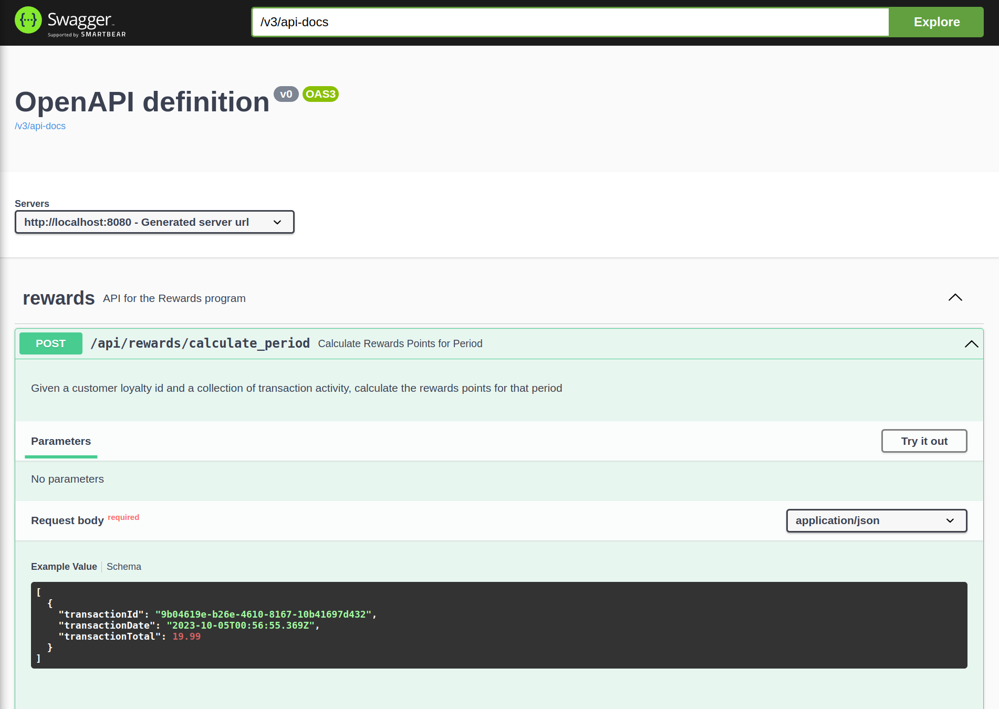
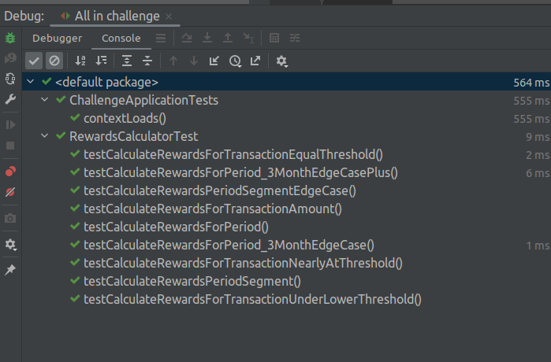
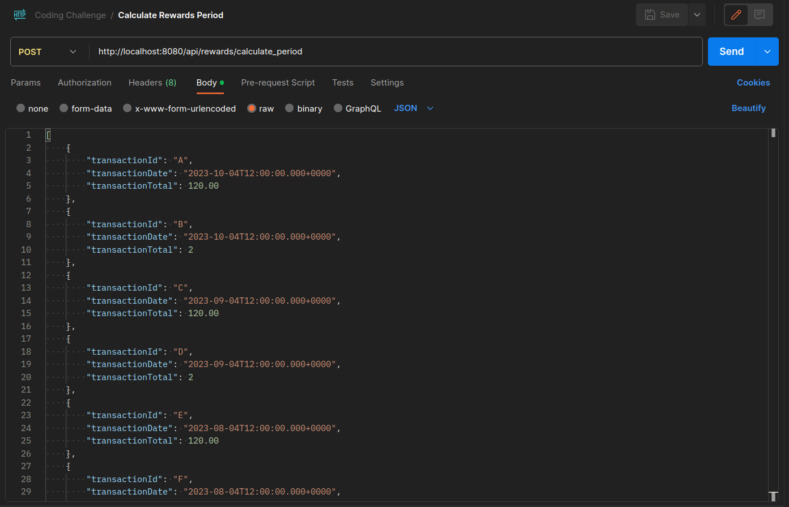
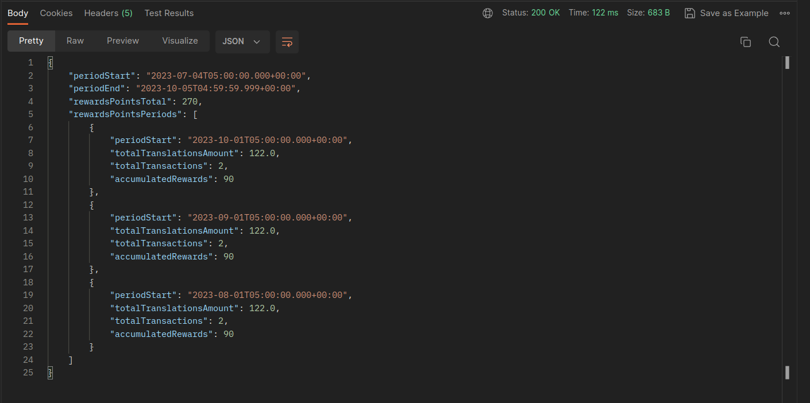

# coding-challenge-20230104
Stellar IT Coding Challenge
# Challenge Request
Coding Challenge:
Problem:
A retailer offers a rewards program to its customers awarding points based on each recorded
purchase as follows:

For every dollar spent over $50 on the transaction, the customer receives one point.
In addition, for every dollar spent over $100, the customer receives another point.
Ex: for a $120 purchase, the customer receives
(120 - 50) x 1 + (120 - 100) x 1 = 90 points

Given a record of every transaction during a three-month period, calculate the reward points
earned for each customer per month and total.
 - Make up a data set to best demonstrate your solution
 - Check solution into GitHub and please share the GitHub URL.

Write a REST API that calculates and returns the reward points in Java using Spring Boot as a
microservice.

Additional Notes:

- All of the code should be provided in GitHub. Check-in all the code into master branch and
squash and re-order all commits if necessary to have clean purposeful commit messages like you
would normally in your job.
- Include a dataset in a table format that shows the customer list, transaction list, monthly total per
customer, and 3 months summary it in, and add an image inside the README.md file with this
data set and results.
- The client would be assessing your Coding Style and your personality when you join as a
developer in their team, not just whether the code runs or logic is correct. So, please follow all of
the Best practices that you know and have implemented in the past while doing this exercise.
- Please pay attention to the way you name your variables, classes, name of your project and
package structure etc. Do not do silly mistakes like declaring variables but not using your
variables anywhere in the code or using something from the Target folder.
- Externalize all the dependencies of your code nicely into property file or resource files in
appropriate locations in package layout.
- Do NOT copy paste from GitHub, Stack Overflow or Leetcode. We run a plagiarism check and
automatically reject all copy past jobs. Taking inspiration from something online is fine but blatant
copy paste or renaming variables after copying and pasting will be very easily flagged by our software.
So, please do it on your own.
- You API should contain clear Documentation (a well formatted README.md and comments in
code, sample Request Response formats, how to invoke your API by any client), a Health Check
Endpoint to check whether the service is running or not by a monitoring tool.
- Write your own Unit Tests and provide instructions on How to run your Tests in your
README.md file
- Show your ability to write well maintainable code by including custom Exception Handling (ability
to identify problems within code easily by throwing custom Errors), custom Logging (different
levels like Verbose etc)
- Additional brownie points if you can containerize your API with Dockerfile and provide instructions
on How to run your dockerized API in REAMDE.md

# Challenge Response

## Configuration

This API requires no external data store for operation, allowing it to be deployed as a microservice.  
The Application supports an application properties setting to control the window of months to accumulate reward points.
change the months value in the hierarchy to meet the current requirements.

**application.properties**
```properties
rewards.window.months = 3
 ```


## APIs Exposed

### Service Health Check API

A simple service health check is expose as GET and will respond with a 'UP' or "DOWN" body message based on the 
configuration parameters of the Rewards calcuation being injected into the API Endpoing.

```code
GET http://localhost:8080/actuator/health
```


Always returns HTTP 200, unless the service is not running at all.

**HTTP RESPONSE BODY**

| VALUE RETURNED     | SERVICE STATE                                                                |
|--------------------|:-----------------------------------------------------------------------------|
| {"status": "UP"}   | The Rewards Service is up and configured to service requests                 |
| {"status": "DOWN"} | The Rewards Service is down and not properly configured to service requests. |


### Transaction Set Rewards Calculation API

Swagger UI is enabled at:

```
http://localhost:8080/swagger-ui/index.html
```

** RESPONSE EXAMPLE **



```code
POST http://localhost:8080/api/rewards/calculate_period
```


Given the requirements, the Request Structure to be sent to the API as JSON Body Payload of an array of TransactionSummaryVO records

**TransactionSummaryVO**

| FIELD            | TYPE                                     | DESCRIPTION                             |
|------------------|:-----------------------------------------|-----------------------------------------|
| transactionId    | STRING                                   | A Transaction Id                        |
| transactionDate  | ISO-8601 As 'yyyy-MM-dd'T'hh:mm:ss.sssZ' | The Date/Time of the transation occured |
| transactionTotal | DOUBLE 2 Decimal Places expected         | The transaction total in monetary units |

*Example JSON request body*
```json
[
  {
    "transactionId": "A", 
    "transactionDate": "2023-10-04T12:00:00.000+0000", 
    "transactionTotal": 120.00
  },
  {
    "transactionId": "B", 
    "transactionDate": "2023-10-04T12:00:00.000+0000", 
    "transactionTotal": 2 },
  {
    "transactionId": "C", 
    "transactionDate": "2023-09-04T12:00:00.000+0000", 
    "transactionTotal": 120.00
  },
  {
    "transactionId": "D", 
    "transactionDate": "2023-09-04T12:00:00.000+0000", 
    "transactionTotal": 2
  },
  {
    "transactionId": "E", 
    "transactionDate": "2023-08-04T12:00:00.000+0000", 
    "transactionTotal": 120.00
  },
  {
    "transactionId": "F", 
    "transactionDate": "2023-08-04T12:00:00.000+0000",
    "transactionTotal": 2
  },
  {
    "transactionId": "G", 
    "transactionDate": "2023-07-04T00:00:00.000+0000", 
    "transactionTotal": 120.00
  },
  {
    "transactionId": "H", 
    "transactionDate": "2023-07-04T00:00:00.000+0000", 
    "transactionTotal": 2
  }
]
````

Reaponse:

| HTTP STATUS       | DESCRIPTION                                 |
|-------------------|:--------------------------------------------|
| 200 - OK          | Request Accepted, rewards responce enclosed |
| 403 - Input Error | Request Not Accepted                        |

With a Response of JSON as follows for that dataset

**RewardsVO**

| FIELD                | TYPE                                     | DESCRIPTION                                         |
|----------------------|:-----------------------------------------|-----------------------------------------------------|
| periodStart          | ISO-8601 As 'yyyy-MM-dd'T'hh:mm:ss.sssZ' | The Start Date/Time this Rewards Period Represents. |
| periodEnd            | ISO-8601 As 'yyyy-MM-dd'T'hh:mm:ss.sssZ' | The End Date/Time this Rewards Period Represents.   |
| rewardsPointsTotal   | INTEGER                                  | The total Rewards Points accumuated this window     |
| rewardsPointsPeriods | ARRAY of RewardsPeriodVO                 | A collection of point assesment per month           |

**RewardsPeriodVO**

| FIELD                   | TYPE                                     | DESCRIPTION                                                                   |
|-------------------------|:-----------------------------------------|-------------------------------------------------------------------------------|
| periodStart             | ISO-8601 As 'yyyy-MM-dd'T'hh:mm:ss.sssZ' | The Start Date/Time this Rewards Period Represents.                           |
| totalTranslationsAmount | DOUBLE                                   | A sum of eligible transactions for this period                                |
| totalTransactions       | INTEGER                                  | A count of eligible transactions for this period                              |
| accumulatedRewards      | INTEGER                                  | The sum of rewards points accumulated for eligible transaction in this period |


*Example Response*
```json
{
"periodStart": "2023-07-04T05:00:00.000+00:00",
"periodEnd": "2023-10-05T04:59:59.999+00:00",
"rewardsPointsTotal": 270,
"rewardsPointsPeriods": [
  {
    "periodStart": "2023-10-01T05:00:00.000+00:00",
    "totalTranslationsAmount": 122.0,
    "totalTransactions": 2,
    "accumulatedRewards": 90
  },
  {
    "periodStart": "2023-09-01T05:00:00.000+00:00",
    "totalTranslationsAmount": 122.0,
    "totalTransactions": 2,
    "accumulatedRewards": 90
  },
  {
    "periodStart": "2023-08-01T05:00:00.000+00:00",
    "totalTranslationsAmount": 122.0,
    "totalTransactions": 2,
    "accumulatedRewards": 90
  }
]
}
```

# Unit Tests

The ```com.coding.challenge.api.RewardsAPI``` is validated with JUnit test cases in ```com.coding.challenge.domain.RewardsCalculatorTest```
which tests the given example from requirements as well as negative tests and edge case tests.

## Run Suite

Run the entire suite in the Maven Lifecycle management by 
```code
bash$ mvn test
```

Which should result in all defined tests being ran as example:

```code
[INFO] Running com.coding.challenge.ChallengeApplicationTests
19:25:43.271 [main] INFO org.springframework.test.context.support.AnnotationConfigContextLoaderUtils -- Could not detect default configuration classes for test class [com.coding.challenge.ChallengeApplicationTests]: ChallengeApplicationTests does not declare any static, non-private, non-final, nested classes annotated with @Configuration.
19:25:43.327 [main] INFO org.springframework.boot.test.context.SpringBootTestContextBootstrapper -- Found @SpringBootConfiguration com.coding.challenge.ChallengeApplication for test class com.coding.challenge.ChallengeApplicationTests

  .   ____          _            __ _ _
 /\\ / ___'_ __ _ _(_)_ __  __ _ \ \ \ \
( ( )\___ | '_ | '_| | '_ \/ _` | \ \ \ \
 \\/  ___)| |_)| | | | | || (_| |  ) ) ) )
  '  |____| .__|_| |_|_| |_\__, | / / / /
 =========|_|==============|___/=/_/_/_/
 :: Spring Boot ::                (v3.1.4)

2023-10-04T19:25:43.567-05:00  INFO 1841737 --- [           main] c.c.challenge.ChallengeApplicationTests  : Starting ChallengeApplicationTests using Java 17.0.8.1 with PID 1841737 (started by jlong23 in /home/jlong23/dev/coding-challenge-20230104)
2023-10-04T19:25:43.568-05:00  INFO 1841737 --- [           main] c.c.challenge.ChallengeApplicationTests  : No active profile set, falling back to 1 default profile: "default"
2023-10-04T19:25:44.206-05:00  INFO 1841737 --- [           main] c.c.challenge.ChallengeApplicationTests  : Started ChallengeApplicationTests in 0.804 seconds (process running for 1.356)
OpenJDK 64-Bit Server VM warning: Sharing is only supported for boot loader classes because bootstrap classpath has been appended
[INFO] Tests run: 1, Failures: 0, Errors: 0, Skipped: 0, Time elapsed: 1.482 s - in com.coding.challenge.ChallengeApplicationTests
[INFO] Running com.coding.challenge.domain.RewardsCalculatorTest
[INFO] Tests run: 9, Failures: 0, Errors: 0, Skipped: 0, Time elapsed: 0.018 s - in com.coding.challenge.domain.RewardsCalculatorTest
[INFO] 
[INFO] Results:
[INFO] 
[INFO] Tests run: 10, Failures: 0, Errors: 0, Skipped: 0
[INFO] 
[INFO] ------------------------------------------------------------------------
[INFO] BUILD SUCCESS
[INFO] ------------------------------------------------------------------------
[INFO] Total time:  2.601 s
[INFO] Finished at: 2023-10-04T19:25:44-05:00
[INFO] ------------------------------------------------------------------------
k
```

*If you use a modern IDE, it gennerally has detection and running facilities for running the unittests in the IDE*



## UnitTests Validation Scenarios

### Rewards Amount Calculation

Validates the expected rewards points for Transactional Amounts 
- **Positive Validations:**
  - com.coding.challenge.domain.RewardsCalculatorTest.testCalculateRewardsForTransactionAmount 
    - Tests the given example of 120 Unit transaction resulting in 90 Rewards points

  - com.coding.challenge.domain.RewardsCalculatorTest.testCalculateRewardsForTransactionUnderLowerThreshold
    - Tests the Lower Threshold value of the Rewards Calculation with 52 Unite resulting in 2 Rewards points


- **Negative & Edge Validations:**
  - com.coding.challenge.domain.RewardsCalculatorTest.testCalculateRewardsForTransactionEqualThreshold
    - Tests the transaction amount equal to the threshold, 50 Units results in 0 Reward points

  - com.coding.challenge.domain.RewardsCalculatorTest.testCalculateRewardsForTransactionNearlyAtThreshold
    -   Edge Test for a transaction amount that is fractionally under the lower threshold amount, 50.99 Units results in 0 Reward points

### Rewards Period Segment Calculations
- **Positive Validations:**
    - com.coding.challenge.domain.RewardsCalculatorTest.testCalculateRewardsPeriodSegment
        - Validates the calculation of the rewards points for a period segment (Month) for the expected results

        - | Transacion Id | Transaction Date | Transaction Amount |
          |---------------|:-----------------|:-------------------|
          | "A"           | *TODAY*          | 120                |


- **Negative & Edge Validations:**
    - com.coding.challenge.domain.RewardsCalculatorTest.testCalculateRewardsPeriodSegmentEdgeCase
        - Tests with two transaction with one below the lower threshold value of the Rewards Calculation with 2 Unite resulting in 0 Rewards points

        - | Transacion Id | Transaction Date | Transaction Amount | 
          |---------------|:-----------------|:-------------------|
          | "A"           | *TODAY*          | 120                |
          | "B"           | *TODAY*          | 2                  |


### Reward Period Calculation

- **Positive & Edge Case Validations:**
    - com.coding.challenge.domain.RewardsCalculatorTest.testCalculateRewardsForPeriod
        - Validates the calculation of the rewards points for a define period (3 Month) for only 1 month of transactions for the expected results

        - | Transacion Id | Transaction Date | Transaction Amount |
          |---------------|:-----------------|:-------------------|
          | "A"           | *TODAY*          | 120                |
          | "B"           | *TODAY*          | 2                  |

    - com.coding.challenge.domain.RewardsCalculatorTest.testCalculateRewardsForPeriod_3MonthEdgeCase
        - Validates the calculation of the rewards points for a define period (3 Month) with 3 months of transactions for the expected results

        - | Transacion Id | Transaction Date  | Transaction Amount |
          |---------------|:------------------|:-------------------|
          | "A"           | *TODAY*           | 120                |
          | "B"           | *TODAY*           | 2                  |
          | "C"           | *TODAY - 1 MONTH* | 120                |
          | "D"           | *TODAY - 1 MONTH* | 2                  |
          | "E"           | *TODAY - 2 MONTH* | 120                |
          | "F"           | *TODAY - 2 MONTH* | 2                  |
  - 
  - com.coding.challenge.domain.RewardsCalculatorTest.testCalculateRewardsForPeriod_3MonthEdgeCasePlus
      - Validates the calculation of the rewards points for a define period (3 Month) with 3 months and One Day of transactions for the expected results, the last two translations "G & H" are excluded due to the date window

      - | Transacion Id | Transaction Date  | Transaction Amount |
        |---------------|:------------------|:-------------------|
        | "A"           | *TODAY*           | 120                |
        | "B"           | *TODAY*           | 2                  |
        | "C"           | *TODAY - 1 MONTH* | 120                |
        | "D"           | *TODAY - 1 MONTH* | 2                  |
        | "E"           | *TODAY - 2 MONTH* | 120                |
        | "F"           | *TODAY - 2 MONTH* | 2                  |
        | "G"           | *TODAY - 3 MONTH* | 120                |
        | "H"           | *TODAY - 3 MONTH* | 2                  |


# Validation Tool Configuration

A Postman Project has been provided in the ./Postman folder with sample data to use.

Import the project and change the endpoint to your deployment needs.

**REQUEST EXAMPLE**



** RESPONSE EXAMPLE **



# Code Rationalization

While not provided in the challenge, I saw a need to ensure we can extend the calculation engine to support windowed 
and recalculation of transaction sets for the windowed total of rewards points.  The Calculation is very strict for 
whole monetary units, for point calculations.  Care was also taken for the window to be Start of the Day 3 months from 
today, a sliding window that would have rewards expire do to the edge conditions of date comparisons.
